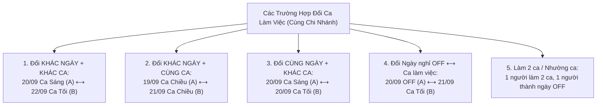
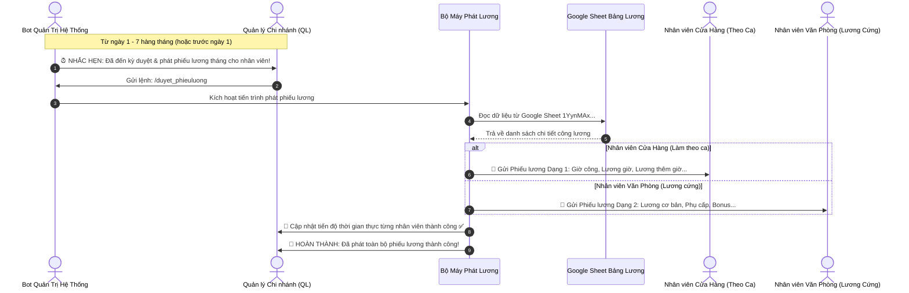

# 📋 KẾ HOẠCH TRIỂN KHAI & ĐẶC TẢ TÍNH NĂNG HỆ THỐNG TELEGRAM BOT ỤM BÒ MILK (V4.7)

> **Phiên bản:** 4.7 (Cập nhật ngày 18/09/2026 - Bổ sung Thông báo Nhân viên mới từ Form Google Sheet NHAN_VIEN_MOI & Bảo mật thông tin đăng nhập tuyệt đối)  
> **Đơn vị áp dụng:** Toàn bộ hệ thống chuỗi cửa hàng & khối văn phòng Ụm Bò Milk  
> **Mô hình kiến trúc:** Tam giác 3 Bot Telegram chuyên biệt + Telegram Mini App tối giản + Realtime Web App Dashboard & Google Sheet 17iXM + Google Sheet Phiếu Lương (Đồng bộ ngầm 100%)

---

## MỤC LỤC
1. [TỔNG QUAN KIẾN TRÚC HỆ THỐNG](#1-tổng-quan-kiến-trúc-hệ-thống)
2. [CẤU HÌNH CA LÀM VIỆC & HOTLINE TRỰC 24/7](#2-cấu-hình-ca-làm-việc--hotline-trực-247)
3. [BOT NHÂN VIÊN (@umbomilknvbot) & MINI APP TỐI GIẢN](#3-bot-nhân-viên-umbomilknvbot--mini-app-tối-giản)
   - [3.1. Cấu trúc Mini App tối giản: Điểm danh & Khóa học](#31-cấu-trúc-mini-app-tối-giản-điểm-danh--khóa-học)
   - [3.2. Điểm danh 2 bước (GPS $\le$ 300m + Ảnh 3 yếu tố) & Tự động đóng app](#32-điểm-danh-2-bước-gps--300m--ảnh-3-yếu-tố--tự-động-đóng-app)
   - [3.3. Chế tài phạt đi trễ & Khóa nghiêm ngặt Check-out sớm](#33-chế-tài-phạt-đi-trễ--khóa-nghiêm-ngặt-check-out-sớm)
   - [3.4. Đăng ký lịch OFF 2 ngày/tuần & Cảnh báo chống đăng ký lại](#34-đăng-ký-lịch-off-2-ngàytuần--cảnh-báo-chống-đăng-ký-lại)
   - [3.5. Chức năng Khóa học / Bài thi trắc nghiệm (25 câu - 8 phút - 3 mức đánh giá)](#35-chức-năng-khóa-học--bài-thi-trắc-nghiệm-25-câu---8-phút---3-mức-đánh-giá)
   - [3.6. Xem Lịch làm việc (/lich), Cảnh báo chờ duyệt tuần sau & Tự động phát lịch](#36-xem-lịch-làm-việc-lich-cảnh-báo-chờ-duyệt-tuần-sau--tự-động-phát-lịch)
4. [QUY TRÌNH ĐỔI CA LÀM VIỆC TRONG TUẦN (SHIFT SWAP V4.4)](#4-quy-trình-đổi-ca-làm-việc-trong-tuần-shift-swap-v44)
   - [4.1. Điều kiện áp dụng & Phạm vi linh hoạt](#41-điều-kiện-áp-dụng--phạm-vi-linh-hoạt)
   - [4.2. Cơ chế tự động hiển thị danh sách Đồng nghiệp cùng chi nhánh](#42-cơ-chế-tự-động-hiển-thị-danh-sách-đồng-nghiệp-cùng-chi-nhánh)
   - [4.3. Các trường hợp đổi ca được hỗ trợ toàn diện](#43-các-trường-hợp-đổi-ca-được-hỗ-trợ-toàn-diện)
   - [4.4. Quy trình 3 bước phê duyệt: NV A $\rightarrow$ NV B $\rightarrow$ Bot Quản trị HR](#44-quy-trình-3-bước-phê-duyệt-nv-a-rightarrow-nv-b-rightarrow-bot-quản-trị-hr)
5. [BOT QUẢN TRỊ HR (@umbomilkhrbot)](#5-bot-quản-trị-hr-umbomilkhrbot)
   - [5.1. Bắt buộc đăng nhập & Hộp thư lưu trữ thông báo (Zero Miss + Chống trùng lặp)](#51-bắt-buộc-đăng-nhập--hộp-thư-lưu-trữ-thông-báo-zero-miss--chống-trùng-lặp)
   - [5.2. Lệnh đổi mật khẩu (/doi_mat_khau)](#52-lệnh-đổi-mật-khẩu-doi_mat_khau)
   - [5.3. Bảng phân quyền 4 vai trò chuẩn hóa (Duyệt lương DUY NHẤT cho QL)](#53-bảng-phân-quyền-4-vai-trò-chuẩn-hóa-duyệt-lương-duy-nhất-cho-ql)
   - [5.4. Tra cứu Hồ sơ nhân viên (/hoso_nhanvien)](#54-tra-cứu-hồ-sơ-nhân-viên-hoso_nhanvien)
   - [5.5. Sửa thông tin nhân viên (/sua_thongtin_nhanvien - Đồng bộ Google Sheet)](#55-sửa-thông-tin-nhân-viên-sua_thongtin_nhanvien---đồng-bộ-google-sheet)
   - [5.6. Lệnh Reset dữ liệu Google Sheet của Admin (/reset_hethong - CHỈ ADMIN)](#56-lệnh-reset-dữ-liệu-google-sheet-của-admin-reset_hethong---chỉ-admin)
   - [5.7. Thông báo Nhân viên mới từ Form Google Sheet (NHAN_VIEN_MOI)](#57-thông-báo-nhân-viên-mới-từ-form-google-sheet-nhan_vien_moi)
   - [5.8. Quy trình Quản lý (QL) duyệt và phát Phiếu lương (/duyet_phieuluong)](#58-quy-trình-quản-lý-ql-duyệt-và-phát-phiếu-lương-duyet_phieuluong)
6. [BOT KẾ TOÁN TÀI CHÍNH (@umbomilkketoanbot)](#6-bot-kế-toán-tài-chính-umbomilkketoanbot)
7. [KỊCH BẢN DEMO TRỰC QUAN TOÀN DIỆN](#7-kịch-bản-demo-trực-quan-toàn-diện)
   - [🎬 DEMO 1: Mini App Tối Giản & Điểm Danh Tự Đóng](#-demo-1-mini-app-tối-giản--điểm-danh-tự-đóng)
   - [🎬 DEMO 2: Cảnh Báo Khi Nhân Viên Đăng Ký Lại Lịch OFF](#-demo-2-cảnh-báo-khi-nhân-viên-đăng-ký-lại-lịch-off)
   - [🎬 DEMO 3: Xem Lịch Làm Việc (/lich) & Tự Động Bắn Lịch Tuần Mới](#-demo-3-xem-lịch-làm-việc-lich--tự-động-bắn-lịch-tuần-mới)
   - [🎬 DEMO 4: Quy Trình Đổi Ca Làm Việc V4.4 (Khác Ngày - Khác Ca)](#-demo-4-quy-trình-đổi-ca-làm-việc-v44-khác-ngày---khác-ca)
   - [🎬 DEMO 5: Đăng Nhập Nhận Thông Báo Chờ & Lọc Trùng Tuyệt Đối](#-demo-5-đăng-nhập-nhận-thông-báo-chờ--lọc-trùng-tuyệt-đối)
   - [🎬 DEMO 6: Sửa Thông Tin Nhân Viên (/sua_thongtin_nhanvien)](#-demo-6-sửa-thông-tin-nhân-viên-sua_thongtin_nhanvien)
   - [🎬 DEMO 7: Reset Dữ Liệu Sheet của Admin (/reset_hethong)](#-demo-7-reset-dữ-liệu-sheet-của-admin-reset_hethong)
   - [🎬 DEMO 8: Thông Báo Nhân Viên Mới Đăng Ký Form Google Sheet](#-demo-8-thông-báo-nhân-viên-mới-đăng-ký-form-google-sheet)
   - [🎬 DEMO 9A: Phiếu Lương Nhân Viên Cửa Hàng (Chỉ QL phát)](#-demo-9a-phiếu-lương-nhân-viên-cửa-hàng-chỉ-ql-phát)
   - [🎬 DEMO 9B: Phiếu Lương Nhân Viên Văn Phòng (Chỉ QL phát)](#-demo-9b-phiếu-lương-nhân-viên-văn-phòng-chỉ-ql-phát)

---

## 1. TỔNG QUAN KIẾN TRÚC HỆ THỐNG

```mermaid
graph TD
    NV[Nhân viên cửa hàng & Văn phòng] -->|Điểm danh, Đổi ca, Thi trắc nghiệm, Nhận phiếu lương| NVBot["Bot Nhân Viên (@umbomilknvbot)"]
    NVBot -->|Mở Mini App tối giản| MiniApp["Telegram Mini App (2 Khối: Điểm danh + Thi trắc nghiệm)"]
    NVBot -->|Bắn yêu cầu đổi ca| NV_B[Nhân viên B nhận xác nhận]
    NV_B -->|Bấm Đồng ý| HRBot["Bot Quản Trị (@umbomilkhrbot)"]
    NVBot -->|Báo cáo kết quả thi, Trễ, Check-out sớm| HRBot
    HRBot -->|Admin, HR, Quản lý cửa hàng (QL), Marketing| B[Ban Quản trị & Điều hành]
    HRBot -->|Nhắc hẹn phát lương ngày 1-7 -> QL gõ /duyet_phieuluong| PayrollEngine[Bộ máy xử lý Phiếu Lương Phân Loại 2 Dạng]
    PayrollEngine -->|Đọc bảng lương| SheetPayroll[(Google Sheet Phiếu Lương 1YynMAx...)]
    PayrollEngine -->|Tự động gửi phiếu lương theo dạng NV Cửa hàng hoặc Văn phòng| NVBot
    NVBot -->|Chấm công, Số giờ, Tiền phạt| FinBot["Bot Tài Chính (@umbomilkketoanbot)"]
    FinBot -->|Đối soát công, Lương, Phạt, Hoàn cọc| C[Kế toán / Tài chính]
    NVBot -.->|Đồng bộ ngầm 100%| DB[(Database & Google Sheet 17iXM)]
    HRBot -.->|Đồng bộ ngầm 100%| DB
```

* **Bot Nhân viên (`@umbomilknvbot`) + Mini App tối giản**: Điểm danh 2 bước (GPS + Ảnh camera 3 yếu tố), tự động đóng app khi xong, khóa check-out sớm, đăng ký OFF, đổi ca làm việc trong tuần, thi trắc nghiệm E-learning 25 câu, **nhận phiếu lương bảo mật định kỳ ngày 1–7 (tự động phân loại NV Cửa hàng hoặc NV Văn phòng)**.
* **Bot Quản trị HR (`@umbomilkhrbot`)**: Tương tác 100% qua chat Telegram (đã bỏ Mini App), bắt buộc đăng nhập, phiên 24h tự động đăng xuất, hỗ trợ đổi mật khẩu, duyệt phiếu đổi ca 3 bước, nhận báo cáo kết quả thi trắc nghiệm theo 3 thang điểm, **tra cứu hồ sơ nhân viên (`/hoso_nhanvien`)**, **nhắc hẹn Quản lý (QL) duyệt phát phiếu lương từ ngày 1–7 hàng tháng (`/duyet_phieuluong`)**.
* **Bot Kế toán (`@umbomilkketoanbot`)**: Tương tác 100% qua chat Telegram (đã bỏ Mini App), tra cứu lương, đối soát chấm công, phạt đi trễ, hoàn tiền cọc.

---

## 2. CẤU HÌNH CA LÀM VIỆC & HOTLINE TRỰC 24/7

### 2.1. Ba ca làm việc cố định (Chuẩn giờ Việt Nam UTC+7)
| Ca làm việc | Khung giờ | Thời lượng | Đơn giá Thử việc | Đơn giá Chính thức | Lương chuẩn / ca (Chính thức) |
| :--- | :---: | :---: | :---: | :---: | :---: |
| **Ca Sáng** | `07:00 – 12:00` | 5 giờ | 21.000đ / h | 25.500đ / h | **127.500đ** |
| **Ca Chiều** | `12:00 – 18:00` | 6 giờ | 21.000đ / h | 25.500đ / h | **153.000đ** |
| **Ca Tối** | `18:00 – 23:00` | 5 giờ | 21.000đ / h | 25.500đ / h | **127.500đ** |

### 2.2. Kênh khẩn cấp & Hotline hỗ trợ trực ca 24/7
* 📞 **Hotline trực ca khẩn cấp 24/7**: **0909.903.609** — **0333.137.633**
* 🆘 Cú pháp bot: `/sos` hiển thị số điện thoại hotline và quy trình báo sự cố đột xuất.

### 2.3. Tọa độ GPS 4 Chi nhánh (Bán kính hợp lệ $\le$ 300m)
* **CN1** (130 Vạn Kiếp, P.3, Q. Bình Thạnh): `10.79815, 106.69145`
* **CN2** (261 Tô Hiến Thành, P.12, Q.10): `10.77885, 106.66425`
* **CN3** (120 Hoàng Diệu 2, P. Linh Trung, TP. Thủ Đức): `10.85240, 106.77120`
* **CN4** (111 Tôn Đản, P.15, Q.4): `10.76010, 106.70630`

---

## 3. BOT NHÂN VIÊN (@umbomilknvbot) & MINI APP TỐI GIẢN

### 3.1. Cấu trúc Mini App tối giản: Điểm danh & Khóa học
* **Cơ chế Login thông minh**:
  * Giữ nguyên màn hình đăng nhập (SĐT / Mã NV).
  * **Tự động bỏ qua màn login** nếu tài khoản Telegram chat đã liên kết trước đó (và ngược lại: đăng nhập trên Mini App tự động liên kết tài khoản chat của bot).
* **Giao diện bên trong tối giản 100%**:
  * Bỏ toàn bộ các tab phụ (Lịch, Thêm, Trang chủ, Lương...).
  * Chỉ hiển thị duy nhất **2 khối chức năng**:
    1. **Khối 1: Điểm danh theo ca** (GPS $\le$ 300m + Camera trực diện 3 yếu tố).
    2. **Khối 2: Khóa học / Bài thi trắc nghiệm E-learning** (25 câu - 8 phút).

---

### 3.2. Điểm danh 2 bước (GPS $\le$ 300m + Ảnh 3 yếu tố) & Tự động đóng app
* **Nhắc vào ca trước 30 phút**: Kích hoạt lúc **06:30** (Ca Sáng), **11:30** (Ca Chiều), **17:30** (Ca Tối).
* **Bước 1 — Vị trí GPS Telegram**:
  * Nhân viên ấn nút lấy vị trí trên Telegram/Mini App.
  * Bot tính khoảng cách Haversine tới chi nhánh gán cho nhân viên:
    * $\le$ 300m: Hợp lệ $\rightarrow$ Chuyển Bước 2.
    * \> 300m: Báo lỗi vị trí quá xa và từ chối.
* **Bước 2 — Chụp ảnh camera trực diện đạt chuẩn 3 yếu tố**:
  * 1️⃣ Rõ khuôn mặt nhân viên.
  * 2️⃣ Mặc đúng đồng phục Ụm Bò Milk.
  * 3️⃣ Đeo bảng tên nhân viên.
* **Tự động đóng Mini App**:
  * Sau khi chụp ảnh và hệ thống xác thực thành công $\rightarrow$ Tự động gọi `Telegram.WebApp.close()` thoát app ngay.
  * Bot trong khung chat gửi tin nhắn xác nhận chi tiết vào ca / ra ca.

---

### 3.3. Chế tài phạt đi trễ & Khóa nghiêm ngặt Check-out sớm
* **Chế tài xử phạt đi trễ**:
  * Trễ $\le$ 5 phút: 0đ (Đúng giờ).
  * Trễ 5–30 phút: Phạt **30.000đ**, tự động ghi `db.penalties` và thông báo về Bot HR.
  * Trễ > 30 phút: Phạt **50% lương ca** (`63.750đ` ca 5h, `76.500đ` ca 6h), kích hoạt báo động khẩn về Bot HR.
* **Khóa nghiêm ngặt Check-out sớm**:
  * Tuyệt đối không cho phép check-out trước giờ kết thúc ca (trước 12:00, 18:00, 23:00).
  * Nếu nhân viên mở Mini App khi chưa hết giờ ca:
    * Mini App hiển thị **hộp cảnh báo đỏ vi phạm**.
    * **Khóa hoàn toàn nút check-out** (disabled).
    * Gửi cảnh báo vi phạm về Bot Quản trị HR nếu nhân viên cố tình gõ lệnh check-out sớm.

---

### 3.4. Đăng ký lịch OFF 2 ngày/tuần & Cảnh báo chống đăng ký lại
* **Khung giờ mở cổng**: **12h00 Thứ 6 đến 15h00 Thứ 7** hàng tuần (Giờ VN).
* **Cú pháp gửi**: Nhắn tự nhiên `18/09/2026, 22/09/2026` hoặc `/off 18/09/2026, 22/09/2026`.
* **RÀNG BUỘC CẢNH BÁO CHỐNG ĐĂNG KÝ LẠI (Anti-Overwrite Warning)**:
  * Khi nhân viên gửi yêu cầu đăng ký OFF: Hệ thống kiểm tra trong tuần làm việc kế tiếp nhân viên đó đã có bản ghi đăng ký OFF (`OFF_REQUEST` hoặc trạng thái đã xếp 2 ngày OFF) hay chưa.
  * **Nếu đã đăng ký rồi**: Khi nhân viên bấm đăng ký lại hoặc gửi lại ngày, **BOT Telegram lập tức bật cảnh báo**, hiển thị rõ:
    * ⚠️ Cảnh báo bạn đã đăng ký lịch OFF tuần này rồi!
    * Thông tin 2 ngày OFF đã đăng ký trước đó.
    * Trạng thái hiện tại (Đang chờ HR duyệt hoặc Đã duyệt).
    * Hướng dẫn nhân viên: Quy định chỉ đăng ký tối đa 2 ngày OFF/tuần, nếu cần điều chỉnh vui lòng liên hệ Quản lý hoặc dùng chức năng **"🔄 Đổi ca"** với đồng nghiệp.
* **CẢNH BÁO XUNG ĐỘT TRÙNG NGÀY NGHỈ CÙNG CA (Colleague Off Conflict)**:
  * Nếu đồng nghiệp **CÙNG CHI NHÁNH + CÙNG CA LÀM VIỆC** đã đăng ký nghỉ trước đó trên một trong các ngày mà nhân viên đang chọn, Bot lập tức cảnh báo từ chối: hai nhân viên cùng ca không thể cùng nghỉ 1 ngày (đảm bảo luôn có người trực ca tại cửa hàng).
* **3 NGUYÊN TẮC TỰ ĐỘNG SẮP LỊCH TRÊN BOT TELEGRAM (Auto-Scheduling Rules)**:
  1. 🚫 **Nhân viên A và B cùng Chi nhánh + CÙNG ca làm việc**: BOT telegram tự động sắp lịch sao cho 2 nhân viên này **KHÔNG TRÙNG CA LÀM VIỆC TRONG 1 NGÀY** (người này làm thì người kia nghỉ luân phiên qua thuật toán phân bổ công bằng `pickFair`).
  2. 👥 **Nhân viên A và B cùng Chi nhánh + KHÁC ca làm việc** (VD: A ca sáng, B ca tối): BOT telegram tự động sắp lịch sao cho 2 nhân viên này **ĐƯỢC TRÙNG CA LÀM VIỆC TRONG 1 NGÀY** (cả hai cùng đi làm bình thường tại chi nhánh trong ngày đó).
  3. 🌐 **Nhân viên A và B KHÁC chi nhánh + KHÁC ca làm việc** (hoặc khác chi nhánh nói chung): BOT telegram tự động sắp lịch sao cho 2 nhân viên này **ĐƯỢC TRÙNG CA LÀM VIỆC TRONG 1 NGÀY** (lịch làm việc độc lập theo từng chi nhánh).
* Tuyệt đối không nhắc từ khóa "Google Sheet" trong tin nhắn gửi nhân viên.

---

### 3.5. Chức năng Khóa học / Bài thi trắc nghiệm (25 câu - 8 phút - 3 mức đánh giá)
* **Quy cách đề thi**:
  * HR có quyền chỉ định kiểm tra bất kỳ nhân viên nào hoặc kiểm tra định kỳ.
  * Đề thi gồm **25 câu trắc nghiệm = 10 điểm** (0.4 điểm/câu).
  * Thời gian làm bài: **8 phút** (480 giây), có đồng hồ đếm ngược, tự động nộp bài khi hết giờ.
* **Quy tắc chấm điểm & đánh giá (3 mức chuẩn)**:
  1. **Điểm < 5 điểm**: **KHÔNG ĐẠT**  
     $\rightarrow$ Bot thông báo đánh giá nhân viên (cần đào tạo lại quy trình) + Gửi báo cáo kết quả sang Bot Admin/HR.
  2. **5 đến dưới 8 điểm**: **THI LẠI**  
     $\rightarrow$ Bot thông báo đánh giá nhân viên (chưa đạt chuẩn kiến thức) + Gửi báo cáo sang Bot Admin/HR để HR xếp lịch thi lại.
  3. **$\ge$ 8 điểm**: **ĐẠT 🎆**  
     $\rightarrow$ Bot chúc mừng và đánh giá xuất sắc + Gửi báo cáo thành tích sang Bot Admin/HR.

---

### 3.6. Xem Lịch làm việc (/lich), Cảnh báo chờ duyệt tuần sau & Tự động phát lịch
* **Khi nhân viên bấm "📅 Lịch làm việc" hoặc gõ `/lich`**:
  1. **Cập nhật & Hiển thị Lịch tuần hiện tại**: Bot hiển thị chi tiết lịch làm việc 7 ngày của tuần này (Thứ 2 đến Chủ nhật), gồm ngày, thứ, ca làm (hoặc OFF) và chi nhánh.
  2. **Kiểm tra trạng thái Lịch tuần sau**:
     * **Nếu HR CHƯA DUYỆT**: Bot đính kèm thông báo rõ ràng:
       > ⏳ **LỊCH TUẦN SAU (21/09 – 27/09/2026):**  
       > ⚠️ **Lịch tuần sau của bạn HR chưa duyệt lịch, vui lòng chờ...**  
       > 🔔 *Ngay khi HR phê duyệt, Bot Telegram sẽ tự động gửi thông báo lịch tuần mới tới bạn!*
     * **Nếu HR ĐÃ DUYỆT**: Hiển thị luôn lịch làm việc tuần sau cho nhân viên.
* **Cơ chế Tự động Bắn thông báo Lịch tuần mới (Push Notification)**:
  * Ngay khi HR phê duyệt lịch tuần mới (qua Bot HR hoặc Web App), hệ thống kích hoạt tự động:
  * **Bot Telegram chủ động bắn tin nhắn riêng** tới từng nhân viên thông báo lịch tuần mới đã được phê duyệt, kèm chi tiết ca làm việc từng ngày. Nhân viên không cần phải hỏi lại Quản lý!

---

## 4. QUY TRÌNH ĐỔI CA LÀM VIỆC TRONG TUẦN (SHIFT SWAP V4.4)

### 4.1. Điều kiện áp dụng & Phạm vi linh hoạt
1. **Lịch đã duyệt**: Chỉ áp dụng khi đã có lịch làm việc chính thức do HR phê duyệt (`approvalStatus: 'APPROVED'`).
2. **CÙNG CHI NHÁNH (Bắt buộc 100%)**: Cả 2 nhân viên A và B phải làm việc tại cùng một chi nhánh (VD: cùng CN1 - 130 Vạn Kiếp).
3. **ĐỔI KHÁC NGÀY & KHÁC CA HOÀN TOÀN LINH HOẠT**:
   * **Không nhất thiết phải cùng một ngày**: Nhân viên có thể đổi ca ở **hai ngày hoàn toàn khác nhau** trong tuần.
     * *Ví dụ:* Ca Sáng ngày 20/09 của NV A hoán đổi lấy Ca Tối ngày 22/09 của NV B.
   * **Đổi khác ca làm việc**: Ca Sáng $\leftrightarrow$ Ca Chiều, Ca Sáng $\leftrightarrow$ Ca Tối, Ca Chiều $\leftrightarrow$ Ca Tối.
   * **Đổi Ca làm việc $\leftrightarrow$ Ngày nghỉ (OFF)**: Hoán đổi ngày OFF của người này sang ca làm việc của người kia ở ngày khác.
   * **Làm 2 ca / Nhường ca**: 1 bạn làm 2 ca để bạn kia được nghỉ nguyên ngày.
4. **Áp dụng trong tuần**: Đảm bảo điều phối nhân sự gọn gàng theo chu kỳ tuần từ Thứ 2 đến Chủ nhật.

---

### 4.2. Cơ chế tự động hiển thị danh sách Đồng nghiệp cùng chi nhánh
Khi nhân viên bấm nút **"🔄 Đổi ca"** trên bàn phím menu Bot hoặc gửi lệnh `/doica`:
1. **Xác thực chi nhánh**: Bot tự động đối soát Telegram ID của nhân viên gửi để nhận diện Chi nhánh hiện tại (VD: `CN1 - 130 Vạn Kiếp`).
2. **Lọc đồng nghiệp**: Hệ thống lọc danh sách toàn bộ nhân viên đang làm việc trong cùng chi nhánh đó (loại trừ chính mình và nhân viên đã nghỉ việc/lưu trữ).
3. **Hiển thị nút bấm trực quan (Inline Keyboard)**: Bot gửi tin nhắn kèm các nút bấm mang tên từng đồng nghiệp để người dùng chạm chọn nhanh chóng:
   * `[ 👤 Trần Thị Lan (NV1289) ]`
   * `[ 👤 Lê Hoàng Nam (NV1290) ]`
   * `[ 👤 Phạm Minh Tuấn (NV1295) ]`
4. **Hiển thị đối chiếu lịch làm việc tuần này**: Khi chọn đồng nghiệp B, Bot liệt kê lịch làm việc tuần của cả A và B để A dễ dàng chọn ngày & ca muốn hoán đổi (cùng ngày hoặc khác ngày).
5. **Hỗ trợ song song cú pháp nhanh**: Nhân viên vẫn có thể gõ trực tiếp cú pháp văn bản nhanh chóng:
   * `Cú pháp:` `/doica <ngày_A> <ca_A> sang <NV_B> <ngày_B> <ca_B>`
   * *Ví dụ đổi khác ngày, khác ca:* `/doica 20/09 Ca Sáng sang Lan 22/09 Ca Tối`
   * *Ví dụ đổi khác ngày, cùng ca:* `/doica 19/09 Ca Chiều sang NV1289 21/09 Ca Chiều`
   * *Ví dụ đổi cùng ngày, khác ca:* `/doica 20/09 Ca Sáng sang Lan 20/09 Ca Tối`
   * *Ví dụ đổi ngày nghỉ sang ca làm:* `/doica 20/09 OFF sang Lan 21/09 Ca Tối`

---

### 4.3. Các trường hợp đổi ca được hỗ trợ toàn diện



---

### 4.4. Quy trình 3 bước phê duyệt: NV A $\rightarrow$ NV B $\rightarrow$ Bot Quản trị HR
* **Bước 1 (Gửi yêu cầu)**: NV A bấm nút chọn đồng nghiệp B + chọn ngày/ca của A và ngày/ca của B (hoặc gõ lệnh `/doica ...`). Bot tạo phiếu ở trạng thái chờ B xác nhận.
* **Bước 2 (NV B xác nhận)**: NV B nhận tin nhắn riêng hiển thị rõ ràng 2 ngày và 2 ca hoán đổi kèm 2 nút tương tác: `[✅ ĐỒNG Ý ĐỔI CA]` | `[❌ TỪ CHỐI]`.
* **Bước 3 (HR duyệt & Cập nhật)**: Khi NV B bấm đồng ý $\rightarrow$ Phiếu tự động chuyển sang Bot Quản trị HR kèm 2 nút: `[✅ PHÊ DUYỆT ĐỔI CA]` | `[❌ TỪ CHỐI]`. Khi HR duyệt $\rightarrow$ Hệ thống tự động cập nhật lịch của cả 2 bạn ở cả 2 ngày liên quan trên Database và đồng bộ ngầm Google Sheet 17iXM.

---

## 5. BOT QUẢN TRỊ HR (@umbomilkhrbot)

### 5.1. Bắt buộc đăng nhập, Cảnh báo trạng thái tài khoản & Hộp thư lưu trữ (Zero Miss + Chống trùng lặp)
* Mọi tương tác yêu cầu phải đăng nhập: `/login <tên_đăng_nhập> <mật_khẩu>`.
* **Thời hạn phiên đúng 24 tiếng** (`24 * 60 * 60 * 1000` ms): Hết 24 giờ phiên tự hủy, yêu cầu đăng nhập lại.
* **CẢNH BÁO TRẠNG THÁI HOẠT ĐỘNG CỦA TÀI KHOẢN (Active / Inactive Status Alert)**:
  * Khi nhân sự gửi bất kỳ tin nhắn nào tới Bot Quản trị mà **chưa đăng nhập** (hoặc hết phiên 24h):
    * **BOT lập tức hiển thị cảnh báo đỏ trực quan**:
      > 🔴 **TRẠNG THÁI: TÀI KHOẢN CHƯA ĐĂNG NHẬP (CHƯA HOẠT ĐỘNG)**  
      > ⚠️ *Hệ thống quản trị đang ở trạng thái TẠM KHÓA. Bạn cần đăng nhập để kích hoạt phiên làm việc và kiểm tra thông báo nhân sự.*  
      > 👉 *Cú pháp đăng nhập:* `<code>/login &lt;tài_khoản&gt; &lt;mật_khẩu&gt;</code>`
    * Nhờ đó nhân sự luôn nắm bắt chính xác tài khoản của mình có đang hoạt động hay không, không bị nhầm lẫn giữa lỗi mạng hay chưa đăng nhập!
  * **Khi đã đăng nhập thành công**: Bot hiển thị rõ `🟢 TRẠNG THÁI: TÀI KHOẢN ĐANG HOẠT ĐỘNG (Hiệu lực: 24 giờ)`.
* **Cơ chế Lưu trữ & Bù phát Thông báo Thông minh (Zero Miss)**:
  * Khi có sự kiện phát sinh (yêu cầu đổi ca chờ HR duyệt, bài thi trắc nghiệm không đạt/thi lại, sự cố thiết bị khẩn cấp, cảnh báo check-out sớm...):
    * **Nếu nhân sự/HR chưa đăng nhập vào Bot**: Hệ thống tự động ghi nhận thông báo vào hàng đợi an toàn (`adminNotificationQueue`).
* **QUY TẮC CHỐNG TRÙNG LẶP DỮ LIỆU TUYỆT ĐỐI (Strict Deduplication)**:
  * Mỗi thông báo được gán một định danh duy nhất `dedupeKey` (VD: `swap:uuid`, `quiz:empId:score`, `earlyCheckout:date:empId`).
  * **Nếu thông báo nhân viên đó BOT đã gửi trước đó rồi và trên tài khoản quản trị đã có thông tin rồi thì BỎ QUA thông báo đó và chỉ gửi các thông báo mới còn lại**.
  * Ngay khi nhân sự đăng nhập thành công (`/login`), Bot đối soát hộp thư chờ, lọc bỏ toàn bộ thông báo đã xử lý/đã gửi, và chỉ hiển thị các thông báo chưa đọc thực sự, **tránh hoàn toàn việc trùng lặp dữ liệu hay spam tin nhắn**!

---

### 5.2. Lệnh đổi mật khẩu (/doi_mat_khau)
* Cú pháp: `/doi_mat_khau <tên_đăng_nhập> <mật_khẩu_cu> <mật_khẩu_moi>`.
* Áp dụng cho: **Admin, HR, QL (Quản lý), MKT (Marketing)**.

---

### 5.3. Bảng phân quyền 4 vai trò chuẩn hóa (Duyệt lương DUY NHẤT cho QL)
> [!IMPORTANT]
> **Chuẩn hóa phân quyền tuyệt đối**:
> * Cú pháp và chức năng **Duyệt phiếu lương (`/duyet_phieuluong`) ĐÃ BỎ HOÀN TOÀN** trên tài khoản **HR, Admin và MKT**. Chức năng này **chỉ hiển thị và cho phép thực thi DUY NHẤT trên tài khoản Quản lý cửa hàng (QL)**.
> * Nếu Admin, HR, MKT gõ `/duyet_phieuluong`, Bot lập tức từ chối và giải thích rõ thẩm quyền thuộc về QL.

| Vai trò | Quyền hạn nghiệp vụ | Danh mục lệnh Telegram chuẩn |
| :--- | :--- | :--- |
| 👑 **Admin** | Toàn quyền hệ thống, cấp/phân quyền, chạy test, reset dữ liệu Google Sheet, xóa nhân viên | `/tonghop_lich`, `/sap_lich_nv`, `/sua_thongtin_nhanvien`, `/xoa_nhanvien`, `/duyet`, `/users`, `/capquyen`, `/phanquyen`, `/broadcast`, `/test`, `/delete_test`, `/doi_mat_khau`, `/hoso_nhanvien`, `/reset_hethong`, `/logout` |
| 🛡️ **HR** | Quản lý lịch tuần NV, sửa thông tin NV, xóa NV, duyệt đổi ca, báo cáo, tra hồ sơ | `/tonghop_lich`, `/sap_lich_nv`, `/sua_thongtin_nhanvien`, `/xoa_nhanvien`, `/duyet`, `/baocao`, `/broadcast`, `/gui_de_thi`, `/doi_mat_khau`, `/hoso_nhanvien`, `/logout` |
| 🏪 **QL** | Giới hạn chi nhánh phụ trách (`branchScope`), **DUYỆT & PHÁT PHIẾU LƯƠNG THÁNG** | `/diemdanh_cn`, `/lich_cn`, `/duyet_ca`, `/baohong_cn`, `/doi_mat_khau`, `/duyet_phieuluong`, `/hoso_nhanvien`, `/logout` |
| 📢 **MKT** | Đăng tin tức, sự kiện, phát khuyến mãi tới nhân viên | `/broadcast_mkt`, `/sukien`, `/tintuc`, `/doi_mat_khau`, `/logout` |

---

### 5.4. Tra cứu Hồ sơ nhân viên (/hoso_nhanvien)
* **Quy định bảo mật**: Chức năng tra cứu hồ sơ nhân viên **chỉ thông báo và hiển thị duy nhất trên BOT Quản trị Admin/HR/QL**.
* **Cú pháp thực hiện**: `/hoso_nhanvien: <mã_nhân_viên>` hoặc `/hoso_nhanvien <mã_nhân_viên>`.
* **Nội dung hồ sơ gửi lên gồm 6 thông tin chuẩn hóa**:
  1. 👤 **Tên nhân viên**
  2. 📱 **Số điện thoại**
  3. 🆔 **Mã nhân viên**
  4. 📅 **Ngày bắt đầu tham gia**
  5. 🏪 **Chi nhánh + Ca làm việc**
  6. 💰 **Lương chính thức**

---

### 5.5. Sửa thông tin nhân viên (/sua_thongtin_nhanvien - Đồng bộ Google Sheet)
* **Mục đích**: Cho phép HR / Admin điều chỉnh nhanh ca làm việc hoặc chuyển chi nhánh cho nhân viên trực tiếp trên chat Bot mà không cần thao tác thủ công.
* **Cú pháp gửi yêu cầu**:
  * `/sua_thongtin_nhanvien: <Mã_NV> <ca_cu> sang <ca_moi>, <CN_cu> sang <CN_moi>`
  * *Ví dụ đầy đủ:* `/sua_thongtin_nhanvien: NV1288 ca sáng sang ca tối, CN1 sang CN2`
  * *Ví dụ chỉ đổi ca:* `/sua_thongtin_nhanvien: NV1288 ca sáng sang ca tối`
  * *Ví dụ chỉ đổi chi nhánh:* `/sua_thongtin_nhanvien: NV1288 CN1 sang CN2`
* **Cơ chế cập nhật & Đồng bộ tức thì**:
  1. Bot tìm kiếm nhân viên theo mã (hỗ trợ mã ngắn `NV1288`, `1288` hoặc mã đầy đủ).
  2. Cập nhật trường `shift` và `branchId` trong cơ sở dữ liệu `db.employees`.
  3. **Đồng bộ ngầm ngay lập tức sang Google Sheet 17iXM** (các tab liên quan: `NHAN_VIEN_CHINH_THUC` / `NHAN_VIEN_TRAINING` và `LICH_LAM_VIEC`).
  4. Bot phản hồi xác nhận thành công và gửi thông báo cập nhật tới nhân viên liên quan.

---

### 5.6. Lệnh Reset dữ liệu Google Sheet của Admin (/reset_hethong)
> [!CAUTION]
> **Ràng buộc phân quyền tối cao**:
> * **Lệnh `/reset_hethong` CHỈ THỰC HIỆN MỖI TÀI KHOẢN ADMIN (👑)**.
> * Các tài khoản còn lại (**HR, QL, MKT**) **TUYỆT ĐỐI KHÔNG CÓ QUYỀN** và hệ thống lập tức từ chối truy cập nếu cố tình thực thi!

* **Cú pháp thực hiện**:
  * `/reset_hethong: <tên_sheet>` hoặc `/reset_hethong <tên_sheet>`
  * *Ví dụ:* `/reset_hethong LICH_LAM_VIEC`
  * *Ví dụ:* `/reset_hethong RECORD_DIEM_DANH`
* **Hành vi xử lý**:
  1. Kết nối với Google Sheet 17iXM qua Google Sheets API.
  2. Xóa sạch toàn bộ các dòng dữ liệu từ dòng 2 trở đi (`!A2:Z`) của tab sheet chỉ định, **bảo toàn nguyên vẹn dòng tiêu đề (header row 1)**.
  3. Tùy chọn làm sạch bản ghi tương ứng trong cơ sở dữ liệu để đồng bộ 100%.
  4. Bot phản hồi thông báo xác nhận số dòng đã dọn dẹp sạch sẽ.

---

### 5.6B. Xóa vĩnh viễn nhân viên (/xoa_nhanvien - Google Sheet 17iXM & Hệ thống)
> [!WARNING]
> **Quy định bảo mật & Quyền hạn**:
> * Lệnh `/xoa_nhanvien` **CHỈ CHO PHÉP THỰC THI BỞI TÀI KHOẢN ADMIN (👑) VÀ HR (🛡️)**.
> * Các tài khoản QL và MKT bị từ chối truy cập 100%.
> * Nếu HR có cấu hình giới hạn chi nhánh (`branchScope`), chỉ được xóa nhân viên thuộc chi nhánh quản lý của mình.

* **Cú pháp thực hiện**:
  * `/xoa_nhanvien <Mã_NV>` hoặc `/xoa_nhanvien: <Mã_NV>`
  * *Ví dụ:* `/xoa_nhanvien NV1288` hoặc `/xoa_nhanvien: 1288`
* **Hành vi xử lý tức thì (Dual Delete & Realtime Revocation)**:
  1. **Google Sheet 17iXM**: Quét toàn bộ các tab của bảng tính (`NHAN_VIEN_TRAINING`, `NHAN_VIEN_CHINH_THUC`, `NHAN_VIEN_MOI`, `LICH_LAM_VIEC`, `PHIEU_OFF_HANG_TUAN`, v.v.) và thực hiện xóa sạch toàn bộ dòng dữ liệu của nhân viên thông qua Google Sheets API v4 (`deleteDimension` batchUpdate) và Webhook Push. Dòng tiêu đề (headers) giữ nguyên vẹn 100%.
  2. **Hệ thống Web App / Database**: Cascade xóa sạch sẽ toàn bộ dữ liệu gồm: Hồ sơ (`db.employees`), Chìa khóa (`db.keys`), Lịch làm việc (`db.schedules`), Chấm công (`db.attendances`), Phiếu OFF (`db.offRequests`), Phiếu đổi ca (`db.shiftSwapRequests`), Sự cố thiết bị (`db.deviceRequests`), Phiếu training (`db.trainingShiftRequests`), Bài test (`db.testResults`), Liên kết Bot (`db.telegramLinks`), và Hộp thư thông báo.
  3. **Thu hồi phiên làm việc tức thì (Force Logout)**: Ngay lập tức phát sự kiện `employee:forceLogout` qua WebSocket và hủy phiên đăng nhập của nhân viên trên mọi thiết bị.
  4. Bot gửi báo cáo tổng kết chi tiết số lượng dữ liệu đã dọn dẹp trên Web App và danh sách các tab Google Sheet đã xóa dòng thành công.

---

### 5.7. Thông báo Nhân viên mới từ Form Google Sheet (NHAN_VIEN_MOI)
* **Nguồn dữ liệu**: Lắng nghe và đồng bộ từ Google Form đổ về Sheet `NHAN_VIEN_MOI`:
  * Link Google Sheet: `https://docs.google.com/spreadsheets/d/17iXM0zc1m17aX9AZrFMjOkPRMy2_CwWfjTRZSUPQF2w/edit?usp=sharing`
  * Sheet ID: `17iXM0zc1m17aX9AZrFMjOkPRMy2_CwWfjTRZSUPQF2w`
  * Tên tab: `NHAN_VIEN_MOI`
* **Thông tin lấy chính xác từ các cột trên Sheet**:
  1. 🆔 **Mã ứng viên (ID)**
  2. 📅 **Ngày đăng ký**
  3. 👤 **Họ và tên**
  4. 🚻 **Giới tính & Năm sinh**
  5. 🎓 **Trình độ học vấn & Quê quán**
  6. 📱 **Số điện thoại liên hệ**
  7. ⏰ **Ca đăng ký mong muốn**
  8. 🏪 **Chi nhánh đăng ký làm việc**
  9. 💼 **Kinh nghiệm làm việc & Khả năng xử lý đột xuất**
  10. 🌐 **Facebook & Nguồn biết tin tuyển dụng**
  11. 🤖 **Điểm AI đánh giá & Kết quả sơ loại**
* **Cơ chế thông báo & Ràng buộc Không Miss / Không Trùng**:
  * Khi có ứng viên/nhân viên mới nộp form đăng ký vào sheet `NHAN_VIEN_MOI`:
    * Nếu tài khoản HR/Admin **đang đăng nhập**: Bot Quản trị (`@umbomilkhrbot`) lập tức gửi thông báo đẩy thời gian thực kèm đầy đủ các trường thông tin trên để HR phỏng vấn/xử lý ngay.
    * Nếu HR/Admin **chưa đăng nhập**: Thông báo được lưu vào Hộp thư chờ (`adminNotificationQueue`) với khóa `dedupeKey: applicant:<ID>`. Khi nhân sự đăng nhập sẽ nhận lại đầy đủ (Zero Miss).
    * Áp dụng quy tắc lọc trùng tuyệt đối: nếu ứng viên đó đã được thông báo trước đó thì bỏ qua, không gửi lặp lại (Zero Duplicate).

---

### 5.8. Quy trình Quản lý (QL) duyệt và phát Phiếu lương (/duyet_phieuluong)



* **Nguồn dữ liệu đối soát Google Sheet**:
  * Link Sheet: `https://docs.google.com/spreadsheets/d/1YynMAxLgf005ghoIYPvtMrKTMr6QqmUtsuB9MkLf__k/edit?usp=sharing`
  * Sheet ID: `1YynMAxLgf005ghoIYPvtMrKTMr6QqmUtsuB9MkLf__k`
* **Lịch trình và Nhắc hẹn**:
  * Chu kỳ phát lương: **Từ ngày 1 đến ngày 7 hàng tháng**.
  * Trước khung ngày này (hoặc sáng ngày 1): BOT Admin tự động thông báo đến tài khoản QL nhắc hẹn phát lương.
* **Cơ chế phân loại 2 dạng Phiếu lương**:

#### 🏪 Dạng 1: Phiếu lương dành cho Nhân viên Cửa hàng (Làm việc theo ca)
*Đặc thù: Tính theo giờ công thực tế, lương theo giờ và phụ trội thêm giờ; KHÔNG có mục Lương cơ bản.*
Gồm chính xác **11 mục thông tin**:
1. 🆔 **Mã nhân viên**
2. 👤 **Tên nhân viên**
3. ⏱️ **Ngày công chính (giờ)**
4. ⏱️ **Lương giờ**
5. ➕ **Lương thêm giờ**
6. 🎁 **Phụ cấp**
7. 🌟 **Bonus (OT, Lễ)**
8. 💰 **Tổng lương**
9. ➖ **Trừ KPI**
10. 💳 **Ứng lương**
11. 💵 **CÒN LÃNH**

#### 🏢 Dạng 2: Phiếu lương dành cho Nhân viên Văn phòng
*Đặc thù: Hưởng lương cứng theo tháng; KHÔNG hiển thị ngày công giờ hay lương giờ.*
Gồm chính xác **9 mục thông tin**:
1. 🆔 **Mã nhân viên**
2. 👤 **Tên nhân viên**
3. 💵 **Lương cơ bản**
4. 🎁 **Phụ cấp**
5. 🌟 **Bonus (OT, Lễ)**
6. 💰 **Tổng lương**
7. ➖ **Trừ KPI**
8. 💳 **Ứng lương**
9. 💵 **CÒN LÃNH**

---

## 6. BOT KẾ TOÁN TÀI CHÍNH (@umbomilkketoanbot)
* Tương tác qua lệnh chat native:
  * `/luong`: Tra cứu tức thì bảng chấm công tổng hợp, tổng giờ làm, khấu trừ phạt trễ, thực nhận.
  * `/hoancoc`: Tra cứu danh sách hoàn cọc đồng phục và tiền khám sức khỏe.
* Bỏ Mini App, tinh gọn tối đa giao diện.

---

## 7. KỊCH BẢN DEMO TRỰC QUAN TOÀN DIỆN

### 🎬 DEMO 1: MINI APP TỐI GIẢN & ĐIỂM DANH TỰ ĐÓNG
```
┌──────────────────────────────────────────────┐
│  🐮 ỤM BÒ MILK — NHÂN VIÊN CỬA HÀNG          │
│  Xin chào: Nguyễn Văn A (CN130_NV1288)       │
├──────────────────────────────────────────────┤
│  📍 KHỐI 1: ĐIỂM DANH THEO CA                │
│  [ Bước 1: Vị trí GPS (Đã đạt: Cách 45m) ✅ ] │
│  [ Bước 2: Camera 3 yếu tố (Mặt+Áo+Thẻ) 📸 ] │
│  [ 🚀 HOÀN THÀNH ĐIỂM DANH (TỰ ĐÓNG APP) ]   │
├──────────────────────────────────────────────┤
│  🎓 KHỐI 2: KHÓA HỌC & BÀI THI TRẮC NGHIỆM  │
│  Bài thi: Quy trình Vận hành & Pha chế       │
│  [ 📝 BẮT ĐẦU LÀM BÀI THI (8 PHÚT) ]         │
└──────────────────────────────────────────────┘
```

---

### 🎬 DEMO 2: CẢNH BÁO KHI NHÂN VIÊN ĐĂNG KÝ LẠI LỊCH OFF

*Giả định: Nhân viên Nguyễn Văn A đã đăng ký 2 ngày OFF tuần sau là `18/09/2026, 22/09/2026`.*  
*Khi nhân viên gửi lại tin nhắn đăng ký OFF:*
`19/09/2026, 23/09/2026`

#### Bot `@umbomilknvbot` lập tức gửi cảnh báo:
```html
⚠️ <b>CẢNH BÁO: BẠN ĐÃ ĐĂNG KÝ LỊCH OFF TUẦN NÀY RỒI!</b>

📋 <b>Thông tin đăng ký hiện tại của bạn:</b>
• <b>2 ngày OFF đã ghi nhận:</b> <code>18/09/2026, 22/09/2026</code>
• <b>Trạng thái:</b> ⏳ Đang chờ HR phê duyệt lịch tuần

📌 <b>Quy định công ty:</b> Mỗi nhân viên chỉ được đăng ký tối đa 2 ngày OFF trong 1 tuần làm việc. Hệ thống không cho phép tự ý ghi đè.
👉 <i>Nếu bạn có nhu cầu thay đổi, vui lòng:</i>
1. Liên hệ trực tiếp Quản lý cửa hàng hoặc HR để được hỗ trợ.
2. Hoặc dùng chức năng <b>"🔄 Đổi ca"</b> để hoán đổi ngày làm việc với đồng nghiệp cùng chi nhánh.
```

---

### 🎬 DEMO 3: XEM LỊCH LÀM VIỆC (/lich) & TỰ ĐỘNG BẮN LỊCH TUẦN MỚI

#### 1. Nhân viên gõ lệnh `/lich` (khi HR chưa duyệt lịch tuần sau):
*Bot phản hồi chi tiết lịch tuần hiện tại + cảnh báo chờ lịch tuần sau:*
```html
📅 <b>LỊCH LÀM VIỆC CỦA BẠN — ỤM BÒ MILK</b>
👤 <b>Nhân viên:</b> Nguyễn Văn A (<code>CN130_NV1288</code>)
🏪 <b>Chi nhánh:</b> CN1 - 130 Vạn Kiếp (P.3, Q. Bình Thạnh)

━━━━━━━━━━━━━━━━━━━━━━━━━━
🗓️ <b>LỊCH TUẦN HIỆN TẠI (14/09 – 20/09/2026):</b>
• Thứ 2 (14/09): ☀️ Ca Sáng (07:00 – 12:00)
• Thứ 3 (15/09): ☀️ Ca Sáng (07:00 – 12:00)
• Thứ 4 (16/09): 🏖️ Nghỉ (OFF)
• Thứ 5 (17/09): ☀️ Ca Sáng (07:00 – 12:00)
• Thứ 6 (18/09): 🏖️ Nghỉ (OFF)
• Thứ 7 (19/09): 🌙 Ca Tối (18:00 – 23:00)
• Chủ nhật (20/09): ☀️ Ca Sáng (07:00 – 12:00)
━━━━━━━━━━━━━━━━━━━━━━━━━━
⏳ <b>LỊCH TUẦN SAU (21/09 – 27/09/2026):</b>
⚠️ <b>HR chưa duyệt lịch tuần sau của bạn. Vui lòng chờ...</b>
🔔 <i>Ngay khi HR phê duyệt, Bot Telegram sẽ tự động gửi thông báo lịch tuần mới tới bạn!</i>
```

#### 2. Khi HR duyệt lịch tuần sau trên hệ thống:
*Bot `@umbomilknvbot` tự động kích hoạt thông báo riêng tới từng nhân viên:*
```html
🎉 <b>THÔNG BÁO: LỊCH LÀM VIỆC TUẦN MỚI ĐÃ ĐƯỢC HR PHÊ DUYỆT!</b>
📅 <b>Tuần làm việc:</b> 21/09/2026 – 27/09/2026
🏪 <b>Chi nhánh:</b> CN1 - 130 Vạn Kiếp

📋 <b>Chi tiết phân ca tuần mới của bạn:</b>
• Thứ 2 (21/09): ☀️ Ca Sáng (07:00 – 12:00)
• Thứ 3 (22/09): 🏖️ Nghỉ (OFF)
• Thứ 4 (23/09): ⛅ Ca Chiều (12:00 – 18:00)
• Thứ 5 (24/09): ☀️ Ca Sáng (07:00 – 12:00)
• Thứ 6 (25/09): 🏖️ Nghỉ (OFF)
• Thứ 7 (26/09): 🌙 Ca Tối (18:00 – 23:00)
• Chủ nhật (27/09): ☀️ Ca Sáng (07:00 – 12:00)

💪 <i>Chúc bạn một tuần làm việc tràn đầy năng lượng và hiệu quả!</i>
```

---

### 🎬 DEMO 4: QUY TRÌNH ĐỔI CA LÀM VIỆC V4.4 (CHỌN ĐỒNG NGHIỆP TRỰC QUAN)

#### Bước 1A: Nhân viên A (Nguyễn Văn A - CN1) bấm nút "🔄 Đổi ca" trên menu Bot Nhân viên
*Bot `@umbomilknvbot` tự nhận diện chi nhánh CN1 và gửi danh sách đồng nghiệp cùng chi nhánh:*
```html
🔄 <b>YÊU CẦU ĐỔI CA — Đổi ca làm việc / Tráo ca trong tuần</b>
🏪 <b>Chi nhánh:</b> CN1 - 130 Vạn Kiếp (P.3, Q. Bình Thạnh)
👤 <b>Bạn:</b> Nguyễn Văn A (<code>CN130_NV1288</code>)

👇 <b>Vui lòng chạm chọn bạn đồng nghiệp cùng chi nhánh bạn muốn đổi ca:</b>
```
**Bàn phím Inline tương tác:**
```
┌──────────────────────────────────────────────┐
│  👤 Trần Thị Lan (NV1289)                     │
├──────────────────────────────────────────────┤
│  👤 Lê Hoàng Nam (NV1290)                     │
├──────────────────────────────────────────────┤
│  👤 Phạm Minh Tuấn (NV1295)                   │
└──────────────────────────────────────────────┘
```
*(💡 Hoặc nhân viên có thể gõ cú pháp nhanh: `/doica 20/09 Ca Sáng sang Lan 20/09 Ca Tối`)*

---

#### Bước 1B: Nhân viên A chạm vào nút `[ 👤 Trần Thị Lan (NV1289) ]`
*Bot đối chiếu và hiển thị lịch tuần này của cả bạn A và bạn Lan để A dễ dàng chọn hoán đổi (cùng ngày hoặc khác ngày):*
```html
🔄 <b>ĐỔI CA VỚI ĐỒNG NGHIỆP: Trần Thị Lan (CN130_NV1289)</b>
🏪 <b>Chi nhánh:</b> CN1 - 130 Vạn Kiếp (P.3, Q. Bình Thạnh)

📅 <b>LỊCH TUẦN NÀY CỦA BẠN (A):</b>
• 20/09: ☀️ Ca Sáng (07:00 – 12:00)
• 21/09: 🏖️ Nghỉ (OFF)
• 22/09: 🌙 Ca Tối (18:00 – 23:00)

📅 <b>LỊCH TUẦN NÀY CỦA LAN (B):</b>
• 20/09: ⛅ Ca Chiều (12:00 – 18:00)
• 21/09: ☀️ Ca Sáng (07:00 – 12:00)
• 22/09: 🌙 Ca Tối (18:00 – 23:00)

👉 <b>Chạm nút chọn ca muốn hoán đổi (Hoặc gõ cú pháp nhanh):</b>
```
**Bàn phím tương tác chọn ca nhanh (Hỗ trợ KHÁC NGÀY & KHÁC CA):**
```
┌──────────────────────────────────────────────┐
│  🔁 Đổi: 20/09 Ca Sáng ⟷ Lan 22/09 Ca Tối   │
├──────────────────────────────────────────────┤
│  🔁 Đổi: 20/09 Ca Sáng ⟷ Lan 20/09 Ca Chiều │
├──────────────────────────────────────────────┤
│  🔁 Đổi: 21/09 OFF     ⟷ Lan 21/09 Ca Sáng  │
├──────────────────────────────────────────────┤
│  ✍️ Nhập cú pháp tự do khác ngày / khác ca    │
└──────────────────────────────────────────────┘
```
*(💡 Nhân viên bấm chọn hoán đổi khác ngày: **20/09 Ca Sáng lấy 22/09 Ca Tối**).*  
*Bot gửi xác nhận cho NV A:*
```html
🔄 <b>ĐÃ GỬI YÊU CẦU ĐỔI CA LÀM VIỆC THÀNH CÔNG!</b>

📋 <b>Chi tiết yêu cầu hoán đổi (Khác ngày - Khác ca):</b>
• <b>Người gửi:</b> Nguyễn Văn A (<code>CN130_NV1288</code>)
• <b>Ca muốn nhượng của A:</b> 20/09 — <b>Ca Sáng</b> (07:00 – 12:00)
• <b>Đồng nghiệp nhận ca:</b> Trần Thị Lan (<code>CN130_NV1289</code>)
• <b>Ca nhận lại từ Lan:</b> 22/09 — <b>Ca Tối</b> (18:00 – 23:00)

⏳ <i>Hệ thống đã gửi tin nhắn riêng cho bạn Trần Thị Lan để chờ xác nhận...</i>
```

---

#### Bước 2: Bạn B (Trần Thị Lan) nhận tin nhắn riêng trên `@umbomilknvbot`
```html
🔔 <b>BẠN CÓ YÊU CẦU ĐỔI CA LÀM VIỆC MỚI!</b>

👤 Đồng nghiệp <b>Nguyễn Văn A</b> (<code>CN130_NV1288</code>) gửi lời mời hoán đổi ca:
🏪 <b>Chi nhánh:</b> CN1 - 130 Vạn Kiếp

📅 <b>Ca của bạn A nhượng lại:</b> 20/09 — <b>Ca Sáng</b> (07:00 – 12:00)
🔁 <b>Đổi lấy ca này của bạn:</b> 22/09 — <b>Ca Tối</b> (18:00 – 23:00)

<i>(Nếu đồng ý: Bạn sẽ làm Ca Sáng 20/09 và được nghỉ hoặc đổi ca ngày 22/09)</i>

Bạn có đồng ý hoán đổi lịch làm việc này không?
```
**Bàn phím Inline tương tác trên máy bạn Lan:**
```
┌────────────────────────┬─────────────────────┐
│  ✅ ĐỒNG Ý ĐỔI CA      │  ❌ TỪ CHỐI         │
└────────────────────────┴─────────────────────┘
```
*Bạn Lan bấm nút **[✅ ĐỒNG Ý ĐỔI CA]**.*  
*Bot phản hồi bạn Lan:* `✅ Bạn đã đồng ý đổi ca! Phiếu đã được chuyển đến Quản lý / HR để phê duyệt chính thức.`

---

#### Bước 3: Bot Quản trị HR (`@umbomilkhrbot`) nhận phiếu chờ duyệt
```html
📋 <b>PHIẾU ĐỔI CA LÀM VIỆC CHỜ PHÊ DUYỆT</b>
🏪 <b>Chi nhánh:</b> CN1 - 130 Vạn Kiếp (Đổi khác ngày trong tuần)

👤 <b>Nhân viên A:</b> Nguyễn Văn A (<code>CN130_NV1288</code>)
⏰ <b>Ca hoán đổi:</b> Nhượng 20/09 Ca Sáng ➔ Nhận 22/09 Ca Tối

👤 <b>Nhân viên B:</b> Trần Thị Lan (<code>CN130_NV1289</code>)
⏰ <b>Ca hoán đổi:</b> Nhượng 22/09 Ca Tối ➔ Nhận 20/09 Ca Sáng

✅ <b>Trạng thái:</b> Đồng nghiệp B (Lan) đã bấm ĐỒNG Ý!
```
**Bàn phím duyệt của HR / Admin trên Bot Quản trị:**
```
┌────────────────────────┬─────────────────────┐
│  ✅ PHÊ DUYỆT ĐỔI CA   │  ❌ TỪ CHỐI DUYỆT   │
└────────────────────────┴─────────────────────┘
```
*Khi HR bấm **[✅ PHÊ DUYỆT ĐỔI CA]**:*
1. Bot HR phản hồi: `✅ Đã phê duyệt và hoán đổi lịch làm việc thành công!`
2. Hệ thống cập nhật lịch cả 2 bạn ở cả 2 ngày (20/09 và 22/09) tức thì trên Database và đồng bộ ngầm Google Sheet 17iXM.
3. Bot tự động bắn thông báo kết quả tới cả bạn A và bạn Lan:
   * *Gửi bạn A:* `🎉 HR đã phê duyệt yêu cầu đổi ca! Lịch làm việc mới của bạn: Ngày 20/09 bạn được OFF Ca Sáng, và ngày 22/09 bạn sẽ làm Ca Tối (18:00 – 23:00). Chúc bạn làm việc tốt!`
   * *Gửi bạn Lan:* `🎉 Phiếu đổi ca với Nguyễn Văn A đã được HR duyệt! Lịch làm việc mới của bạn: Ngày 20/09 bạn sẽ làm Ca Sáng (07:00 – 12:00), và ngày 22/09 bạn được OFF Ca Tối. Chúc bạn làm việc tốt!`

---

---

### 🎬 DEMO 5: ĐĂNG NHẬP NHẬN THÔNG BÁO CHỜ & LỌC TRÙNG TUYỆT ĐỐI

*Giả định: Trong thời gian HR vắng mặt, có 3 sự kiện phát sinh. Trong đó sự kiện 1 đã được gửi trước đó và trên tài khoản quản trị đã có thông tin. Bot tự động lọc bỏ sự kiện 1, chỉ gửi 2 thông báo mới chưa trùng lặp.*

#### Khi HR đăng nhập:
`/login <tên_đăng_nhập> <mật_khẩu>`
*(Hệ thống không hiển thị tài khoản và mật khẩu mẫu ra màn hình để bảo mật tuyệt đối).*

#### Bot HR lập tức trả về Menu kèm danh sách thông báo đã lọc trùng:
```html
✅ <b>ĐĂNG NHẬP THÀNH CÔNG!</b>
Chào mừng <b>Nguyễn Mai Phương</b> (Vai trò: <code>HR</code>).

🔔 <b>HỘP THƯ CHỜ: BẠN CÓ 2 THÔNG BÁO MỚI (ĐÃ LỌC BỎ THÔNG BÁO TRÙNG LẶP):</b>
━━━━━━━━━━━━━━━━━━━━━━━━━━
1️⃣ <b>[ĐỔI CA CHỜ DUYỆT]</b>: NV Nguyễn Văn A (CN1) đổi ca 20/09 Ca Sáng lấy 22/09 Ca Tối của Trần Thị Lan. Lan đã bấm ĐỒNG Ý! (Gõ <code>/duyet</code> để phê duyệt).
2️⃣ <b>[KẾT QUẢ THI E-LEARNING]</b>: NV Phạm Minh Tuấn đạt <b>9.2/10 điểm</b> (Xuất sắc 🎆).
━━━━━━━━━━━━━━━━━━━━━━━━━━
<i>Hệ thống tự động bỏ qua các thông báo đã tồn tại trên tài khoản quản trị, đảm bảo không trùng lặp dữ liệu!</i>
```

---

### 🎬 DEMO 6: SỬA THÔNG TIN NHÂN VIÊN (/sua_thongtin_nhanvien)

#### HR gửi lệnh điều chỉnh ca làm và chi nhánh:
`/sua_thongtin_nhanvien: NV1288 ca sáng sang ca tối, CN1 sang CN2`

#### Bot HR phản hồi & Tự động đồng bộ Google Sheet:
```html
✅ <b>CẬP NHẬT THÔNG TIN NHÂN VIÊN THÀNH CÔNG!</b>

👤 <b>Nhân viên:</b> Nguyễn Văn A (<code>CN130_NV1288</code>)
🔄 <b>Ca làm việc:</b> <code>Ca Sáng</code> ➔ <b>Ca Tối (18:00 – 23:00)</b>
🏪 <b>Chi nhánh:</b> <code>CN1 - 130 Vạn Kiếp</code> ➔ <b>CN2 - 261 Tô Hiến Thành</b>
📊 <b>Trạng thái:</b> Đã lưu database & đồng bộ tức thì sang Google Sheet 17iXM ✅

<i>Hệ thống đã gửi thông báo cập nhật lịch mới đến Bot của bạn Nguyễn Văn A.</i>
```

---

### 🎬 DEMO 7: RESET DỮ LIỆU SHEET CỦA ADMIN (/reset_hethong)

#### 1. Admin gửi lệnh xóa sạch dữ liệu sheet:
`/reset_hethong: LICH_LAM_VIEC`

#### Bot Admin phản hồi:
```html
⚠️ <b>XÁC NHẬN DỌN DẸP DỮ LIỆU GOOGLE SHEET</b>
Sheet mục tiêu: <code>LICH_LAM_VIEC</code>

✅ <b>KẾT QUẢ:</b> Đã xóa sạch <b>142 dòng dữ liệu</b> từ dòng A2 đến Z trên Google Sheet!
📌 Dòng tiêu đề (Headers hàng 1) được bảo vệ nguyên vẹn 100%.
⏱️ Thời gian thực thi: 12:30:15 18/09/2026
```

#### 2. Trường hợp HR hoặc QL cố tình gõ lệnh Admin:
*HR gõ:* `/reset_hethong: LICH_LAM_VIEC`  
*Bot từ chối:*
```html
⛔ <b>TỪ CHỐI TRUY CẬP:</b> Chỉ duy nhất Quản trị viên tối cao (👑 Admin) mới có thẩm quyền reset dữ liệu Google Sheet!
```

---

### 🎬 DEMO 8: THÔNG BÁO NHÂN VIÊN MỚI ĐĂNG KÝ FORM GOOGLE SHEET

*Khi có ứng viên/nhân viên mới nộp đơn ứng tuyển qua Google Form (tự động điền dòng mới vào sheet `NHAN_VIEN_MOI`):*  
*Bot Quản trị (`@umbomilkhrbot`) lập tức gửi thông báo đẩy thời gian thực với đầy đủ các cột thông tin từ Sheet:*

```html
🆕 <b>THÔNG BÁO: CÓ ỨNG VIÊN / NHÂN VIÊN MỚI ĐĂNG KÝ!</b>
📊 <b>Nguồn:</b> Google Sheet <code>NHAN_VIEN_MOI</code> (Form Tuyển Dụng)

━━━━━━━━━━━━━━━━━━━━━━━━━━
🆔 <b>Mã ứng viên:</b> <code>UV_2026_0918_042</code>
📅 <b>Ngày đăng ký:</b> 18/09/2026 13:25:40
👤 <b>Họ và tên:</b> Hoàng Minh Thư
🚻 <b>Giới tính:</b> Nữ  |  🎂 <b>Năm sinh:</b> 2004 (22 tuổi)
🎓 <b>Trình độ:</b> Đại học (Năm 4 - ĐH Kinh Tế TP.HCM)
🏡 <b>Quê quán:</b> Lâm Đồng
📱 <b>Số điện thoại:</b> <code>0912345678</code>
⏰ <b>Ca đăng ký:</b> Ca Sáng (07:00 – 12:00) & Ca Chiều (12:00 – 18:00)
🏪 <b>Chi nhánh ĐK:</b> CN1 - 130 Vạn Kiếp (P.3, Q. Bình Thạnh)
💼 <b>Kinh nghiệm:</b> 6 tháng Barista tại The Coffee House
⚡ <b>Xử lý đột xuất:</b> Sẵn sàng tăng ca hoặc đổi ca khi cửa hàng đông khách
🌐 <b>Facebook:</b> fb.com/minhthu.barista
📣 <b>Nguồn biết tin:</b> Fanpage Tuyển dụng Ụm Bò Milk
🤖 <b>Điểm AI đánh giá:</b> <b>8.8 / 10</b> (Phù hợp cao 🌟)
🎯 <b>Kết quả sơ tuyển:</b> Đạt vòng hồ sơ ✅
━━━━━━━━━━━━━━━━━━━━━━━━━━

👉 <i>Nhân sự / Quản lý vui lòng liên hệ ứng viên để hẹn lịch phỏng vấn trực tiếp tại chi nhánh.</i>
```

📌 **Cơ chế đảm bảo Zero Miss & Chống trùng (Zero Duplicate):**
- **Trường hợp HR chưa đăng nhập**: Tin nhắn được đưa vào hàng đợi (`adminNotificationQueue`) với khóa `applicant:UV_2026_0918_042`. Ngay khi HR gõ `/login <tên_đăng_nhập> <mật_khẩu>`, hệ thống sẽ hiển thị lại thông báo này nguyên vẹn.
- **Trường hợp đã thông báo trước đó**: Nếu thông tin ứng viên đã được gửi tới tài khoản quản trị trước đó, Bot sẽ tự động bỏ qua (skip), không gửi lặp lại để tránh làm phiền nhân sự.

---

### 🎬 DEMO 9A: PHIẾU LƯƠNG NHÂN VIÊN CỬA HÀNG (CHỈ QL PHÁT)

#### 1. Khi Quản lý (QL) gửi lệnh duyệt & phát:
QL gửi: `/duyet_phieuluong` trên Bot HR.  
Bot hiển thị tiến độ:
```html
🚀 <b>ĐANG TIẾN HÀNH PHÁT PHIẾU LƯƠNG CHI NHÁNH CN1...</b>

• [1/3] <b>Nguyễn Văn A</b> (<code>CN130_NV1288</code>) — Đã gửi thành công ✅
• [2/3] <b>Trần Thị Lan</b> (<code>CN130_NV1289</code>) — Đã gửi thành công ✅
• [3/3] <b>Lê Hoàng Nam</b> (<code>CN130_NV1290</code>) — Đã gửi thành công ✅

🎉 <b>TỔNG KẾT: ĐÃ GỬI THÀNH CÔNG 3/3 PHIẾU LƯƠNG NHÂN VIÊN!</b>
```

#### 2. Khi HR hoặc Admin thử gõ lệnh:
*HR gửi:* `/duyet_phieuluong`  
*Bot phản hồi:*
```html
⛔ <b>QUYỀN HẠN BỊ TỪ CHỐI:</b>
Chức năng Duyệt & Phát phiếu lương chỉ hiển thị và thực hiện DUY NHẤT trên tài khoản <b>Quản lý cửa hàng (QL)</b>. Tài khoản vai trò HR không có quyền thực hiện.
```

#### 3. Nhân viên Cửa hàng nhận phiếu lương riêng tư trên `@umbomilknvbot`:
```html
💵 <b>PHIẾU LƯƠNG THÁNG 09/2026 — ỤM BÒ MILK</b>
<i>Kính gửi bạn Nguyễn Văn A (Nhân viên Cửa hàng), chi tiết thu nhập của bạn:</i>

━━━━━━━━━━━━━━━━━━━━━━━━━━
🆔 <b>Mã nhân viên:</b> <code>CN130_NV1288</code>
👤 <b>Tên nhân viên:</b> Nguyễn Văn A
⏱️ <b>Ngày công chính (giờ):</b> 132.0 giờ (26 ca làm việc)
⏱️ <b>Lương giờ:</b> 25.500đ / giờ
➕ <b>Lương thêm giờ:</b> 255.000đ (10 giờ phụ trội)
🎁 <b>Phụ cấp:</b> 300.000đ (Chuyên cần & Trách nhiệm)
🌟 <b>Bonus (OT, Lễ):</b> 500.000đ (Thưởng Lễ 2/9)
──────────────────────────
💰 <b>TỔNG LƯƠNG:</b> <b>4.421.000đ</b>
──────────────────────────
➖ <b>Trừ KPI:</b> 0đ (Không có vi phạm)
💳 <b>Ứng lương:</b> 500.000đ (Tạm ứng giữa tháng)
━━━━━━━━━━━━━━━━━━━━━━━━━━
💵 <b>CÒN LÃNH:</b> <b>3.921.000đ</b>
━━━━━━━━━━━━━━━━━━━━━━━━━━

<i>Mọi thắc mắc về bảng lương, vui lòng liên hệ Quản lý cửa hàng hoặc Kế toán chuỗi để được hỗ trợ trong vòng 48 giờ.</i>
```

---

### 🎬 DEMO 9B: PHIẾU LƯƠNG NHÂN VIÊN VĂN PHÒNG (CHỈ QL PHÁT)

```html
💵 <b>PHIẾU LƯƠNG THÁNG 09/2026 — ỤM BÒ MILK</b>
<i>Kính gửi bạn Lê Thị Thu Thảo (Khối Văn phòng), chi tiết thu nhập của bạn:</i>

━━━━━━━━━━━━━━━━━━━━━━━━━━
🆔 <b>Mã nhân viên:</b> <code>VP_HR002</code>
👤 <b>Tên nhân viên:</b> Lê Thị Thu Thảo
💵 <b>Lương cơ bản:</b> 9.500.000đ
🎁 <b>Phụ cấp:</b> 1.000.000đ (Ăn trưa & Điện thoại)
🌟 <b>Bonus (OT, Lễ):</b> 1.500.000đ (Thưởng KPI & Lễ 2/9)
──────────────────────────
💰 <b>TỔNG LƯƠNG:</b> <b>12.000.000đ</b>
──────────────────────────
➖ <b>Trừ KPI:</b> 0đ
💳 <b>Ứng lương:</b> 2.000.000đ (Tạm ứng ngày 15)
━━━━━━━━━━━━━━━━━━━━━━━━━━
💵 <b>CÒN LÃNH:</b> <b>10.000.000đ</b>
━━━━━━━━━━━━━━━━━━━━━━━━━━

<i>Mọi thắc mắc về bảng lương, vui lòng liên hệ Phòng Nhân sự / Kế toán để được giải đáp trong vòng 48 giờ.</i>
```

---

*Tài liệu này là căn cứ kỹ thuật và nghiệp vụ chính thức được cập nhật toàn diện theo yêu cầu mới nhất của Bạn.*
