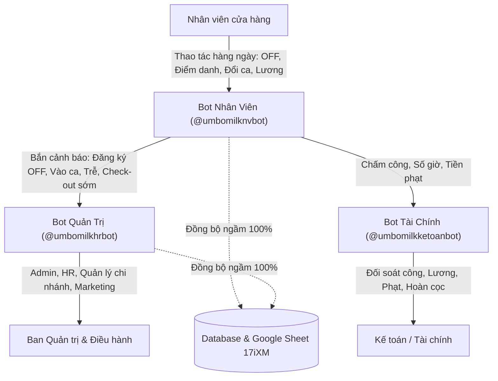

# 📋 KẾ HOẠCH TRIỂN KHAI & ĐẶC TẢ TÍNH NĂNG HỆ THỐNG TELEGRAM BOT ỤM BÒ MILK

> **Phiên bản:** 2.0 (Cập nhật ngày 18/09/2026)  
> **Đơn vị áp dụng:** Toàn bộ hệ thống cửa hàng & khối văn phòng Ụm Bò Milk  
> **Mô hình kiến trúc:** Tam giác 3 Bot Telegram chuyên biệt + Telegram Mini App + Realtime Web App Dashboard & Google Sheet 17iXM (Đồng bộ ngầm 100%)

---

## MỤC LỤC
1. [TỔNG QUAN KIẾN TRÚC HỆ THỐNG 3 BOT](#1-tổng-quan-kiến-trúc-hệ-thống-3-bot)
2. [CẤU HÌNH CA LÀM VIỆC & CHI NHÁNH](#2-cấu-hình-ca-làm-việc--chi-nhánh)
3. [BOT NHÂN VIÊN (@umbomilknvbot)](#3-bot-nhân-viên-umbomilknvbot)
   - [3.1. Liên kết tài khoản](#31-liên-kết-tài-khoản)
   - [3.2. Đăng ký lịch OFF 2 ngày/tuần](#32-đăng-ký-lịch-off-2-ngàytuần)
   - [3.3. Quy trình Điểm danh tự động 2 bước (GPS + Ảnh 3 yếu tố)](#33-quy-trình-điểm-danh-tự-động-2-bước-gps--ảnh-3-yếu-tố)
   - [3.4. Chế tài phạt đi trễ & Khóa Check-out sớm](#34-chế-tài-phạt-đi-trễ--khóa-check-out-sớm)
   - [3.5. Nhắc nhở ca tự động (Background Job)](#35-nhắc-nhở-ca-tự-động-background-job)
   - [3.6. Tiện ích nhanh, Lễ tân AI & Kênh SOS 24/7](#36-tiện-ích-nhanh-lễ-tân-ai--kênh-sos-247)
4. [BOT QUẢN TRỊ HR (@umbomilkhrbot)](#4-bot-quản-trị-hr-umbomilkhrbot)
   - [4.1. Đăng nhập bảo mật & Phân quyền 4 vai trò](#41-đăng-nhập-bảo-mật--phân-quyền-4-vai-trò)
   - [4.2. Ma trận Lịch tuần 🟢/🔴 & Kiểm tra luật AI](#42-ma-trận-lịch-tuần--kiểm-tra-luật-ai)
   - [4.3. Điều chỉnh lịch nhân viên trực tiếp (/sap_lich_nv)](#43-điều-chỉnh-lịch-nhân-viên-trực-tiếp-sap_lich_nv)
   - [4.4. Trung tâm thu nhận cảnh báo thời gian thực](#44-trung-tâm-thu-nhận-cảnh-báo-thời-gian-thực)
   - [4.5. Chế độ kiểm thử an toàn cho Admin (/test & /delete_test)](#45-chế-độ-kiểm-thử-an-toàn-cho-admin-test--delete_test)
5. [BOT KẾ TOÁN TÀI CHÍNH (@umbomilkketoanbot)](#5-bot-kế-toán-tài-chính-umbomilkketoanbot)
6. [BẢO MẬT & BẢO VỆ DỮ LIỆU SẢN XUẤT](#6-bảo-mật--bảo-vệ-dữ-liệu-sản-xuất)
7. [DANH MỤC THAM SỐ CÓ THỂ ĐIỀU CHỈNH](#7-danh-mục-tham-số-có-thể-điều-chỉnh)

---

## 1. TỔNG QUAN KIẾN TRÚC HỆ THỐNG 3 BOT



* **Bot Nhân viên (`@umbomilknvbot`)**: Kênh tương tác chính của toàn bộ nhân viên. Đăng ký OFF, điểm danh 2 bước GPS + Camera, xem lịch, tra cứu lương, đổi ca, báo hỏng thiết bị, kênh khẩn cấp SOS.
* **Bot Quản trị HR (`@umbomilkhrbot`)**: Kênh điều hành của Admin, HR, Quản lý cửa hàng (QL), Marketing (MKT). Có phân quyền nghiêm ngặt, hiển thị ma trận lịch tuần 🟢/🔴, điều chỉnh lịch, nhận cảnh báo vi phạm đi trễ / check-out sớm.
* **Bot Tài chính (`@umbomilkketoanbot`)**: Kênh đối soát lương, khấu trừ tiền phạt, tính công, hoàn cọc đồng phục và tiền khám sức khỏe.
* **Telegram Mini App**: Ứng dụng giao diện web mở trực tiếp trong khung chat Telegram không cần cài đặt thêm.

---

## 2. CẤU HÌNH CA LÀM VIỆC & CHI NHÁNH

### 2.1. Ba ca làm việc cố định (Chuẩn giờ Việt Nam UTC+7)
| Tên ca | Khung giờ | Thời lượng | Đơn giá Thử việc | Đơn giá Chính thức | Tổng lương ca (Chính thức) |
| :--- | :---: | :---: | :---: | :---: | :---: |
| **Ca Sáng** | `07:00 – 12:00` | 5 giờ | 21.000đ / h | 25.500đ / h | 127.500đ |
| **Ca Chiều** | `12:00 – 18:00` | 6 giờ | 21.000đ / h | 25.500đ / h | 153.000đ |
| **Ca Tối** | `18:00 – 23:00` | 5 giờ | 21.000đ / h | 25.500đ / h | 127.500đ |

### 2.2. Tọa độ GPS 4 Chi nhánh (Bán kính hợp lệ $\le$ 300m)
* **CN1** (130 Vạn Kiếp, P.3, Q. Bình Thạnh): `10.79815, 106.69145`
* **CN2** (261 Tô Hiến Thành, P.12, Q.10): `10.77885, 106.66425`
* **CN3** (120 Hoàng Diệu 2, P. Linh Trung, TP. Thủ Đức): `10.85240, 106.77120`
* **CN4** (111 Tôn Đản, P.15, Q.4): `10.76010, 106.70630`

---

## 3. BOT NHÂN VIÊN (@umbomilknvbot)

### 3.1. Liên kết tài khoản
* **Phương thức**:
  1. Nhắn SĐT đã đăng ký hồ sơ (VD: `0842112530` hoặc `/link 0842112530`).
  2. Dùng Mã NV và Key (`/link CN130_UBM... KEY-WBED02RS`).
  3. Mở Mini App bằng nút dưới góc trái khung chat $\rightarrow$ Tự động liên kết qua Start Payload.

---

### 3.2. Đăng ký lịch OFF 2 ngày/tuần
* **Khung giờ mở cổng**: **12h00 Thứ 6 đến 15h00 Thứ 7** hàng tuần (Giờ Việt Nam).
* **Ràng buộc trạng thái theo thời gian**:
  * **Trước 12h00 Thứ 6**: Bot từ chối và phản hồi:  
    `⏳ CHƯA ĐẾN KHUNG GIỜ ĐĂNG KÝ LỊCH OFF` (Cổng mở lúc 12h00 Thứ 6 hàng tuần).
  * **Trong khung giờ**:
    * Nhắc nhở định kỳ mỗi 2 tiếng nếu nhân viên chưa đăng ký.
    * Nhắc nhở khẩn cấp trước hạn 30 phút (lúc 14h30 Thứ 7).
    * Cú pháp gửi: Gõ tự nhiên `18/09/2026, 22/09/2026` hoặc `/off 18/09/2026, 22/09/2026`.
  * **Sau 15h00 Thứ 7**: Bot từ chối và phản hồi:  
    `🔒 ĐÃ HẾT HẠN KHUNG GIỜ ĐĂNG KÝ LỊCH OFF` (Trạng thái: *Chờ Nhân sự cập nhật lịch... Nếu có việc khẩn cấp dùng /sos*).
* **Luồng xử lý tự động**:
  * Ghi nhận đúng 2 ngày `status: 'OFF'`, tự động cập nhật 5 ngày còn lại thành `status: 'WORKING'`.
  * Phản hồi xác nhận thành công hiển thị rõ 2 ngày đăng ký cho nhân viên.
  * **Bắn thông báo tức thì sang Bot Quản trị `@umbomilkhrbot`**:
    ```
    🏖️ THÔNG BÁO ĐĂNG KÝ LỊCH OFF MỚI
    👤 Nhân viên: Nguyễn Văn A (CN130_NV1288)
    🏪 Chi nhánh: CN1 - 130 Vạn Kiếp • Ca: Ca Sáng
    📅 Ngày xin nghỉ OFF: 18/09/2026, 22/09/2026
    ⏱️ Thời gian gửi: 13:45 18/09/2026 (Giờ VN)
    ```
  * **Bảo mật**: Tuyệt đối không nhắc từ khóa "Google Sheet" trong bất kỳ tin nhắn nào gửi nhân viên.

---

### 3.3. Quy trình Điểm danh tự động 2 bước (GPS + Ảnh 3 yếu tố)

#### Màn 1 — Nhắc nhở vào ca trước 30 phút:
* **Khung giờ kích hoạt**: **06:30** (Ca Sáng), **11:30** (Ca Chiều), **17:30** (Ca Tối).
* Bot tự động gửi tin nhắn kèm nút bấm nổi:
  `[📍 BƯỚC 1: GỬI VỊ TRÍ GPS HIỆN TẠI]`

#### Bước 1 — Xác thực vị trí GPS Telegram:
* Nhân viên bấm nút gửi vị trí Telegram (`request_location: true`).
* Bot tính toán khoảng cách Haversine tới chi nhánh đã gán:
  * **Nếu khoảng cách $\le$ 300m**: Hợp lệ $\rightarrow$ Chuyển sang Bước 2.
  * **Nếu khoảng cách > 300m**: Từ chối ngay:  
    `❌ VỊ TRÍ KHÔNG HỢP LỆ (QUÁ XA CỬA HÀNG) - Hiện tại: {distance}m (Giới hạn: 300m)`.

#### Bước 2 — Chụp ảnh camera trực diện đạt chuẩn 3 yếu tố:
* Bot hiển thị bàn phím: `[📸 BƯỚC 2: CHỤP ẢNH XÁC THỰC (CAMERA)]`.
* Nhân viên mở camera chụp ảnh tại quầy làm việc.
* **3 Yếu tố bắt buộc 100%**:
  1. **Khuôn mặt** rõ ràng của nhân viên.
  2. **Mặc đúng đồng phục** Ụm Bò Milk.
  3. **Đeo bảng tên** nhân viên.
* **Kiểm tra**: Nếu thiếu 1 trong 3 yếu tố, bot lập tức từ chối và thông báo rõ yếu tố còn thiếu để chụp lại.

---

### 3.4. Chế tài phạt đi trễ & Khóa Check-out sớm

#### Chế tài đi trễ:
* **Đúng giờ (trễ $\le$ 5 phút)**: Phạt `0đ`, trạng thái `ON_TIME`.
* **Trễ 5+ đến 30 phút**:
  * Phạt cố định **30.000đ**, trạng thái `LATE`.
  * Tự động ghi vào sổ phạt `db.penalties`.
  * Gửi thông báo phạt về `@umbomilkhrbot`.
* **Trễ > 30 phút**:
  * Phạt **50% lương ca** (`63.750đ` cho ca 5h; `76.500đ` cho ca 6h), trạng thái `VERY_LATE`.
  * Tự động ghi vào sổ phạt `db.penalties`.
  * Kích hoạt **BÁO ĐỘNG KHẨN CẤP** tới Quản lý và HR trên `@umbomilkhrbot`.

#### Khóa nghiêm ngặt Check-out sớm:
* **Quy tắc tuyệt đối**: Không được check-out trước giờ kết thúc ca (trước 12:00 Ca Sáng, trước 18:00 Ca Chiều, trước 23:00 Ca Tối).
* **Xử lý vi phạm**: Nếu nhân viên bấm check-out sớm:
  * Bot từ chối lệnh: `🚫 KHÔNG THỂ CHECK-OUT SỚM HƠN GIỜ KẾT THÚC CA! Còn {earlyMins} phút nữa`.
  * Tự động gửi **Cảnh báo vi phạm** về `@umbomilkhrbot`: `🚨 CẢNH BÁO VI PHẠM: NHÂN VIÊN CỐ TÌNH CHECK-OUT SỚM!`.
* **Check-out đúng giờ**: Nhân viên thực hiện đủ 2 bước (GPS + Ảnh) sau giờ ca $\rightarrow$ Bot tính đúng số giờ làm và tiền ca thực nhận (đã trừ tiền phạt trễ nếu có).

---

### 3.5. Nhắc nhở ca tự động (Background Job mỗi 1 phút)
1. **Trước ca 30 phút**: Nhắc vào ca kèm nút gửi GPS (06:30, 11:30, 17:30).
2. **Sau khi bắt đầu ca 10 phút**: Cảnh báo trễ ca phạt 30.000đ nếu chưa điểm danh.
3. **Sau khi bắt đầu ca 30 phút**: Báo động khẩn cấp phạt 50% lương ca tới cả nhân viên và HR.
4. **Trước khi kết thúc ca 10 phút**: Nhắc nhở chuẩn bị check-out (11:50, 17:50, 22:50).

---

### 3.6. Tiện ích nhanh, Lễ tân AI & Kênh SOS 24/7
* `/menu`: Mở bảng chức năng nhanh dạng nút bấm tương tác.
* `/lich`: Xem lịch làm việc 7 ngày tới.
* `/luong`: Tra cứu lương tạm tính tháng hiện tại.
* `/doica`: Hướng dẫn mẫu cú pháp xin đổi/tráo ca.
* `/baohong`: Báo sự cố thiết bị tại quán (cho phép gửi kèm ảnh hỏng).
* `/sos`: Hướng dẫn báo ca khẩn cấp, sự cố bất khả kháng & Hotline 24/7: **0842.112.530**.
* **AI Chat Relay**: Nhân viên nhắn tin tự do bất kỳ $\rightarrow$ AI đọc hiểu, tóm tắt ý chính và chuyển tiếp trực tiếp sang Bot Quản trị HR.

---

## 4. BOT QUẢN TRỊ HR (@umbomilkhrbot)

### 4.1. Đăng nhập bảo mật & Phân quyền 4 vai trò
* Cú pháp bắt buộc: `/login <tên_đăng_nhập> <mật_khẩu>` (VD: `/login admin Master@@2027`).
* Menu và quyền hạn tự động cấp theo vai trò:

| Vai trò | Phân quyền & Mô tả | Danh mục lệnh |
| :--- | :--- | :--- |
| 👑 **Admin** | Toàn quyền hệ thống, cấp quyền người dùng, chạy test an toàn | `/tonghop_lich`, `/sap_lich_nv`, `/duyet`, `/users`, `/capquyen`, `/phanquyen`, `/broadcast`, `/test`, `/delete_test`, `/logout` |
| 🛡️ **HR (Nhân sự)** | Quản lý lịch tuần toàn bộ NV, duyệt phiếu, phát thông báo | `/tonghop_lich`, `/sap_lich_nv`, `/duyet`, `/baocao`, `/broadcast`, `/logout` |
| 🏪 **QL (Quản lý cửa hàng)** | Giới hạn đúng chi nhánh phụ trách (`branchScope`) | `/diemdanh_cn`, `/lich_cn`, `/duyet_ca`, `/baohong_cn`, `/logout` |
| 📢 **MKT (Marketing)** | Đăng tin tức, sự kiện, phát khuyến mãi tới Mini App NV | `/broadcast_mkt`, `/sukien`, `/tintuc`, `/logout` |

---

### 4.2. Ma trận Lịch tuần 🟢/🔴 & Kiểm tra luật AI
* Cú pháp: `/tonghop_lich` (hoặc `/tonghop_lich YYYY-MM-DD`).
* Phân nhóm theo **Chi nhánh + Ca làm việc**.
* Trực quan Thứ 2 $\rightarrow$ Chủ nhật: ngày làm việc `🟢`, ngày nghỉ `🔴`.
* **Hệ thống AI tự động phát hiện**:
  * ⚠️ **Trùng ca**: 2 nhân viên cùng 1 ca tại cùng chi nhánh cùng đi làm một ngày.
  * ⚠️ **Tải ca thấp**: Nhân viên có `< 2 ca/tuần`.

---

### 4.3. Điều chỉnh lịch nhân viên trực tiếp (/sap_lich_nv)
* Hỗ trợ **Mã nhân viên ngắn** (chỉ cần gõ `NV1288` hoặc `1288`).
* Cú pháp: `/sap_lich_nv NV1288 T2-ON, T3-ON, T4-OFF, T5-ON, T6-ON, T7-OFF, CN-ON`.
* Cập nhật tức thì vào cơ sở dữ liệu, đồng bộ ngầm Google Sheet, gửi thông báo trực tiếp tới Telegram của NV.

---

### 4.4. Trung tâm thu nhận cảnh báo thời gian thực
Bot Quản trị HR tự động nhận thông báo tức thì khi:
1. Có nhân viên đăng ký OFF.
2. Có nhân viên vào ca (Check-in).
3. Nhân viên đi trễ ca (phạt 30.000đ).
4. **Báo động khẩn cấp**: Nhân viên trễ > 30 phút (phạt 50% lương ca).
5. **Cảnh báo vi phạm**: Nhân viên cố tình bấm check-out sớm hơn giờ quy định.
6. Nhân viên ra ca (Check-out) thành công kèm số giờ và tiền lương ca.
7. Tin nhắn chuyển tiếp từ nhân viên qua AI Chat Relay.

---

### 4.5. Chế độ kiểm thử an toàn cho Admin (/test & /delete_test)
* `/test <loại>` (`off`, `schedule`, `attendance`, `notification`): Sinh bản ghi test gắn cờ `isTest: true`, hoàn toàn cô lập, không bao giờ ghi đè hoặc rò rỉ vào Google Sheet thật.
* `/delete_test`: Quét và xóa sạch 100% bản ghi test, trả cơ sở dữ liệu về trạng thái sản xuất nguyên vẹn.

---

## 5. BOT KẾ TOÁN TÀI CHÍNH (@umbomilkketoanbot)
* `/luong`: Tra cứu tức thì báo cáo tổng hợp chấm công, tổng số giờ làm việc, tiền phạt trễ đã trừ, số tiền thực nhận.
* `/app`: Mở Mini App Tài chính với bảng ma trận 1–31 ngày, hoàn cọc đồng phục và tiền khám sức khỏe.

---

## 6. BẢO MẬT & BẢO VỆ DỮ LIỆU SẢN XUẤT
1. **Zero Regression**: Đảm bảo 100% bài kiểm thử tự động (28/28 test) luôn PASS trước và sau mọi chỉnh sửa.
2. **Ẩn tích hợp Google Sheet với NV**: Tuyệt đối không xuất hiện chữ "Google Sheet" trong các tin nhắn gửi đến nhân viên. Việc đồng bộ thực hiện hoàn toàn ngầm.
3. **Thiết bị & Phiên làm việc**: Tự động vô hiệu hóa phiên làm việc khi nhân viên bị xóa hoặc nghỉ việc.

---

## 7. DANH MỤC THAM SỐ CÓ THỂ ĐIỀU CHỈNH

| Nhóm tham số | Giá trị hiện tại | Phạm vi điều chỉnh có thể yêu cầu |
| :--- | :--- | :--- |
| **Khung giờ đăng ký OFF** | 12h00 Thứ 6 đến 15h00 Thứ 7 | Có thể đổi ngày mở/đóng hoặc giờ mở/đóng |
| **Số ngày OFF tối đa** | 2 ngày / tuần | Có thể tăng/giảm theo tuần đặc biệt |
| **Nhắc vào ca trước** | **30 phút** (06:30, 11:30, 17:30) | Có thể chỉnh 15, 20, 45 phút... |
| **Bán kính GPS hợp lệ** | **$\le$ 300 mét** | Có thể chỉnh tăng/giảm theo từng chi nhánh |
| **3 Yếu tố ảnh chụp** | Mặt + Đồng phục + Bảng tên | Có thể bổ sung thêm yếu tố (quầy bar, máy POS...) |
| **Mức phạt trễ 5–30 phút** | **30.000đ** | Có thể đổi mức phạt cố định |
| **Mức phạt trễ > 30 phút** | **50% lương ca** | Có thể đổi thành 100% lương ca hoặc số tiền cố định |
| **Khóa check-out sớm** | Chặn 100% trước giờ ca | Có thể cho phép check-out sớm kèm lý do/phạt |
| **Đơn giá giờ làm việc** | 25.500đ (Chính thức) / 21.000đ (Thử việc) | Có thể điều chỉnh theo quyết định ban giám đốc |

---

*Tài liệu này là căn cứ kỹ thuật và nghiệp vụ chính thức của dự án Telegram Bot Ụm Bò Milk.*
